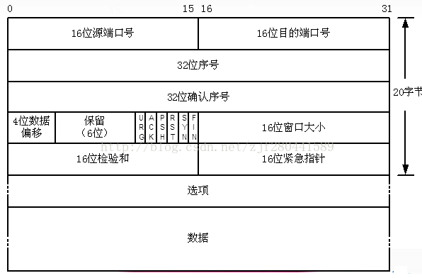

# wireshark简单使用

* 定位设备`rvictl -s 设备ID`
* 过滤ip

```
ip.src == 192.168.0.1
ip.dst == 192.168.0.1
ip.addr == 192.168.0.1
```
* 过滤端口

```
tcp.port == 19201
tcp.dstport == 19201
tcp.srcport == 19201
tcp.port == 19201 && tcp.port == 61073
tcp.port == 19201 || tcp.port == 61073
```
* 过滤协议

```
tcp
udp
arp
icmp
http
smtp
ftp
dns
msnms
ip
ssl
oicq
bootp
```
* 过滤mac地址

```
eth.src == 00:00:00:00:00:00
eth.dst == 00:00:00:00:00:00
eth.addr == 00:00:00:00:00:00
```
* 包长度过滤

```
udp.length > 10     //这个长度是指udp本身固定长度8加上udp下面那块数据包之和
tcp.len >= 90       //指的是ip数据包(tcp下面那块数据),不包括tcp本身
ip.len == 100       //除了以太网头固定长度14,其它都算是ip.len,即从ip本身到最后
frame.len > 10      //整个数据包长度,从eth开始到最后
```
* http过滤模式

```
http.request.method == "GET" 
http.request.method == "POST"
http contains "GET"
http contains "User-Agent:"
http contains "HTTP/1.1 200 OK"
```
* tcp参数过滤

```
tcp.flags           //显示包含TCP标志的封包
tcp.flags.ack == 1 && tcp.flags.syn == 1
tcp.window_size == 0

```
* tcp数据包格式




参考链接
[wireshark基本用法及过虑规则](https://blog.csdn.net/hzhsan/article/details/43453251)
[Wireshark-TCP协议分析](https://blog.csdn.net/ahafg/article/details/51039584)


