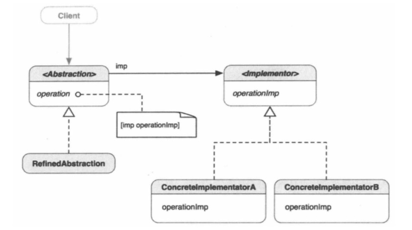

# Design Pattern
* 桥接模式：将抽象部分与它的实现部分分离，使它们都可以独立的变化

* 外观模式：为系统中的一组接口提供一个统一的接口，外观定义一个高层接口，让子系统更易于使用。

* 中介者模式：用一个对象来封装一系列对象的交互方式。中介者使各对象不需要显式地相互引用，从而使其耦合松散，而且可以独立地改变它们之间的交互。

* 备忘录模式：在不破坏封装的前提下，捕获一个对象的内部状态，并在该对象之外保存这个状态，这样以后就可以将该对象恢复到原先保存的状态。

